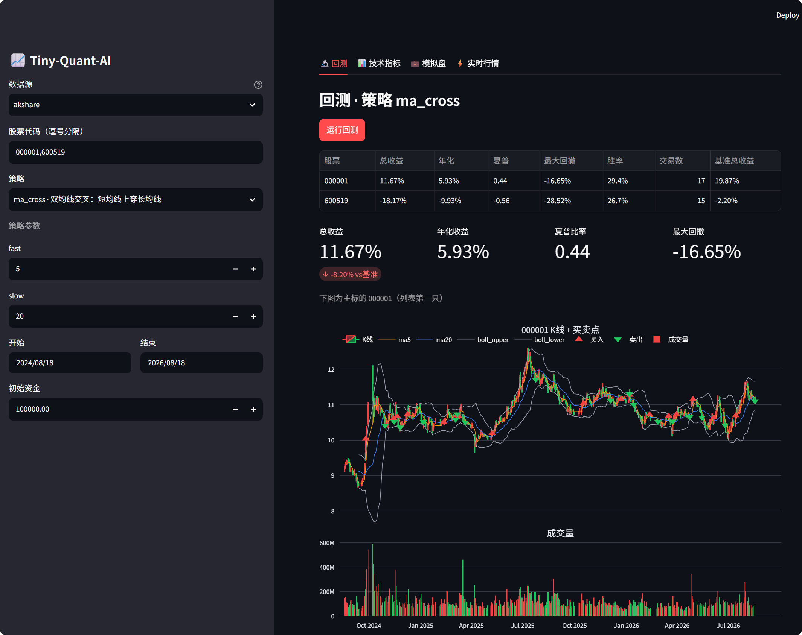
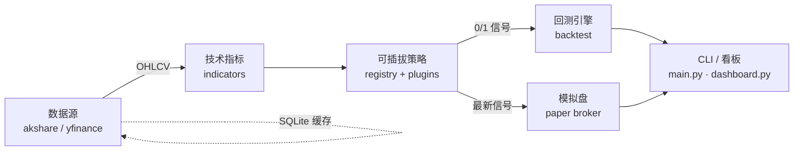

# 📈 Tiny-Quant-AI

> 一个**最小可用、组件可插拔**的 AI 量化交易平台，覆盖「数据 → 指标 → 策略 → 回测 → 模拟盘 → 可视化」完整闭环。支持 A 股（akshare）与美股（yfinance），策略以插件形式随时接入。

<p align="left">
  
  
  
  
</p>



---

## ✨ 功能特性

| 模块 | 说明 | 关键实现 |
| --- | --- | --- |
| 🌐 **实时行情** | 统一数据源接口，A 股 / 美股一键切换 | akshare（东财+新浪双通道自动回退）、yfinance；历史行情 SQLite 缓存 |
| 📊 **技术指标** | 常用指标开箱即用，无需 TA-Lib | 纯 pandas 实现 MA/EMA/MACD/RSI/BOLL/KDJ/ATR/动量 |
| 🧩 **可插拔策略** | 放一个文件即接入，零侵入 | 注册表 + 自动发现；内置技术指标 & 机器学习两类示例 |
| 🔬 **回测引擎** | 向量化、防未来函数 | 次日成交、含手续费；输出收益/夏普/回撤/胜率并对比基准 |
| 💼 **模拟盘** | 真实行情 + 虚拟资金，每日跟踪 | 账户状态持久化，撮合按整手、扣手续费 |
| 🖥️ **交互式看板** | 浏览器里选股选策略看结果 | Streamlit + Plotly，K线买卖点 / 资金曲线 / 回撤 / 持仓一屏可视 |

## 🏗️ 架构总览



## 📦 安装

```bash
pip install -r requirements.txt
```

## 🚀 快速开始（命令行）

```bash
# 1. 查看可用策略
python main.py strategies

# 2. 实时行情 / 技术指标
python main.py quote 000001
python main.py indicators 000001 --start 2024-01-01

# 3. 回测（A股双均线）
python main.py backtest 000001 --strategy ma_cross --start 2023-01-01

# 3b. 回测（美股随机森林），可多只、可绘图、可传参
python main.py backtest AAPL --source yfinance --strategy ml_rf --start 2022-01-01 --plot
python main.py backtest 000001,600519 --strategy ma_cross --param fast=10 slow=30

# 4. 模拟盘：初始化 -> 每日运行 -> 查看收益
python main.py paper init --strategy ma_cross --symbols 000001,600519
python main.py paper run          # 建议每个交易日收盘后跑一次
python main.py paper status

# 5. 交互式网页看板（推荐）
python main.py dashboard          # 等价于 streamlit run dashboard.py
```

> 💡 **Windows PowerShell 提示**：传多只股票请加引号，如 `"000001,600519"`，否则 `000001` 会被 PowerShell 当数字解析成 `1`。

## 🖥️ 交互式看板

```bash
python main.py dashboard          # 浏览器打开 http://localhost:8501
```


看板包含 4 个页签：

| 页签 | 内容 |
| --- | --- |
| 🔬 **回测** | 选股票/策略/参数一键回测，展示指标卡片、多标的对比表、**K线 + 买卖点**、资金曲线、回撤曲线 |
| 📊 **技术指标** | K线叠加均线/布林 + MACD / RSI / KDJ 子图，可查看原始指标数据 |
| 💼 **模拟盘** | 一键初始化 / 调仓 / 刷新，查看持仓、权益曲线、成交记录 |
| ⚡ **实时行情** | 批量查看最新报价与涨跌幅 |

> 上图为「回测」页签：左侧选数据源/股票/策略/参数，右侧实时显示绩效指标、多标的对比、以及标注了买卖点的 K 线与成交量。

## 🧩 内置策略

| 名称 | 类型 | 逻辑 | 默认参数 |
| --- | --- | --- | --- |
| `ma_cross` | 技术指标 | 短均线上穿长均线做多，下穿平仓 | `fast=5, slow=20` |
| `ml_rf` | 机器学习 | 随机森林用技术指标预测次日涨跌，概率超阈值做多 | `train_ratio=0.6, buy_threshold=0.55, n_estimators=200, max_depth=5` |

## 📈 技术指标

| 指标 | 函数 | 说明 |
| --- | --- | --- |
| 均线 | `sma` / `ema` | 简单 / 指数移动平均 |
| MACD | `macd` | 含 DIF / DEA / 柱线 |
| RSI | `rsi` | 相对强弱指标 |
| 布林带 | `bollinger` | 上轨 / 中轨 / 下轨 |
| KDJ | `kdj` | 随机指标 K / D / J |
| ATR | `atr` | 平均真实波幅 |
| 动量 | `momentum` | N 日涨跌幅 |

> 一行 `add_indicators(df)` 即可为行情追加以上全部指标列。

## 📊 绩效指标说明

| 指标 | 含义 |
| --- | --- |
| 总收益 / 年化 | 区间累计收益、年化收益率 |
| 夏普比率 | 单位波动的超额收益，越高越好 |
| 最大回撤 | 资金曲线从高点最大跌幅，越小越好 |
| 卡玛比率 | 年化收益 / 最大回撤 |
| 胜率 / 交易数 | 盈利交易占比、持仓段笔数 |

每项均与「买入持有」基准并列对比，一眼看清策略是否跑赢躺平。

## 🗂️ 目录结构

```
Tiny-Quant-AI/
├── main.py                 # CLI 入口
├── dashboard.py            # Streamlit 交互式看板
├── config.py               # 全局配置（资金/手续费/路径/默认数据源）
├── requirements.txt
├── assets/                 # 截图等静态资源
└── tinyquant/
    ├── data/               # 数据源：抽象接口 + akshare/yfinance + SQLite 缓存
    ├── indicators/         # 技术指标
    ├── strategies/         # 可插拔策略（base + registry + 各策略文件）
    ├── backtest/           # 回测引擎 + 绩效指标
    └── trading/            # 模拟盘经纪商
```

## 🔌 如何新增一个策略（插件）

在 `tinyquant/strategies/` 下新建 `my_strategy.py`：

```python
from .base import Strategy
from .registry import register

@register("my_strategy")
class MyStrategy(Strategy):
    description = "我的策略"

    @classmethod
    def default_params(cls):
        return {"threshold": 30}

    def generate_signals(self, df):
        # df 已带指标列，返回 0/1 目标仓位 Series
        return (df["rsi14"] < self.params["threshold"]).astype(float)
```

保存即可 —— `python main.py strategies` 会**自动发现**它，回测 / 模拟盘 / 看板均可直接使用 `--strategy my_strategy`，看板参数区也会自动生成对应输入框，无需改动任何其它代码。

## ⚠️ 说明与免责

- 回测采用「收盘产生信号、次日按收盘成交」的简化模型，含手续费但不含滑点 / 涨跌停 / 停牌等细节，结果仅供策略**相对比较**。
- ML 策略为示例，虽用训练 / 预测时间切分避免未来函数，但特征与调参都很基础。
- 本项目仅用于学习与研究，**不构成任何投资建议**，据此交易风险自负。
